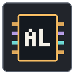

# AdvancedLogic2



**Версия 2.0.0 · Дополнение для WireMod2 3.0.0 · Автор: Dagger · MIT**

Собирайте вычислительные схемы в VoxelCore: передавайте многобитные значения,
выполняйте операции, храните данные и наблюдайте результат на индикаторах.

- Шины 4, 8 и 16 бит с явной маркировкой разрядности в инвентаре.
- Арифметика, сравнение, логические операции и управление потоками данных.
- Адаптеры, объединение и выделение частей шин.
- Регистры, счётчики, тактовые и импульсные генераторы.
- Настраиваемая память RAM/ROM: сетка HEX/DEC, копирование и вставка через поле обмена.
  ROM редактируется вручную, RAM записывается схемой.
- Универсальный индикатор для сигналов 1/4/8/16 бит.
- Совместимые с настенной и потолочной установкой плоские панели.
- Оформление шин в пересечениях передаётся через API WireMod2.
- Четыре готовые `.wms`-схемы в общей библиотеке Logic Configurator: счётчик,
  стенд RAM, 4-битный процессор-аккумулятор и
  [8-битная программируемая машина](docs/MICROCODED_MACHINE.md) с четырьмя операциями и журналом RAM.

## Установка

Установите WireMod2 3.0.0 и распакуйте архив дополнения в тот же каталог `content`.
Должна получиться папка `content/advanced_logic_2` с `package.json` внутри.
Включите оба пакета в настройках контента мира. Идентификатор зависимости —
`wire_mod_2`; проверка версии зависимости движком здесь не задаётся.

Проверено совместно с WireMod2 3.0.0 в локальной сборке VoxelCore проекта
DaggerLab. Состав блоков изменён: старые отдельные варианты большой памяти
заменены настройкой ёмкости. Совместимость старых схем не гарантируется.

## Управление

Используйте Logic Configurator из WireMod2: наведитесь на компонент для просмотра
сигналов и разрядности портов, нажмите ПКМ для настройки. В редакторе памяти
в одной строке восемь слов; числа обозначают значения слов, а не обязательно байты.

## Сборка

Общий сборщик находится в соседнем репозитории WireMod2:

```sh
python3 ../wire_mod2/release.py --pack .
```

Архив по умолчанию появится в `../wire_mod2/dist/`.

## Лицензия

Исходный код и авторские ресурсы проекта распространяются по [MIT](LICENSE).
При распространении сохраняйте текст лицензии и уведомление об авторстве.
