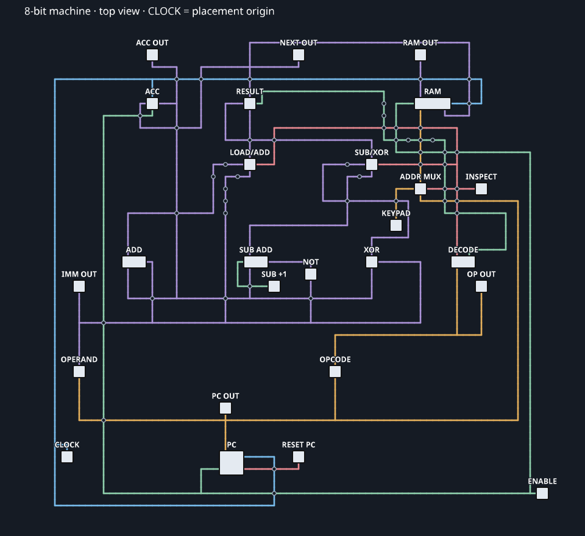

# 8-битная программируемая машина

Готовая схема в библиотеке конфигуратора: **Advanced Logic / Вычисления →
8-битная программируемая машина**. Это последовательная вычислительная машина
из существующих компонентов: 26 устройств, 48 WireBridge и соединяющие их
провода. Размер - **43 × 2 × 39 блоков**; второй слой занимают индикаторы.
Пол в схему не входит. Origin находится на генераторе тактов CLOCK.



## Первый запуск

1. Установите схему на ровную площадку. Генератор **CLOCK** изначально на паузе,
   **ENABLE** включён, **INSPECT** и **RESET PC** выключены. Рычаг **SUB +1**
   возле второго сумматора должен оставаться включённым: это единица для вычитания.
2. Откройте CLOCK конфигуратором и нажмите полный ручной цикл. На **ACC OUT**
   появится 10, на **PC OUT** - 1. Следующие циклы дадут ACC: 15, 12, 243.
3. Снимите паузу CLOCK для автоматического выполнения: одна команда в секунду.
   После адреса 15 счётчик возвращается к 0, программа повторяется.
4. Для остановки включите паузу CLOCK. **ENABLE** также останавливает изменение
   PC, ACC и RAM, но оставляет генератор работающим.

Для перезапуска поставьте CLOCK на паузу, включите и выключите **RESET PC**.
Он сбрасывает только адрес команды. Следующий такт выполнит `LOAD 10` и заново
инициализирует аккумулятор. Старые записи RAM сохраняются до перезаписи.

## Что находится на плате

- **PC** - 4-битный счётчик команд, адресует обе ROM.
- **OPCODE** - ROM с кодами операций; **OPERAND** - ROM с 8-битными операндами.
- **DECODE** выделяет два младших бита кода команды.
- **ADD**, **NOT**, **SUB ADD**, **XOR** вычисляют варианты результата.
  Вычитание реализовано как `ACC + NOT(operand) + 1`.
- **LOAD/ADD**, **SUB/XOR**, **RESULT** - три MUX 2:1 выбирают нужный результат.
- **ACC** - 8-битный регистр; результат возвращается на входы арифметики.
- **RAM** хранит результат каждой выполненной команды по её адресу.
- **ADDR MUX**, **KEYPAD**, **INSPECT** позволяют прочитать отдельную ячейку RAM.

На одном положительном фронте такта аккумулятор принимает результат, RAM
записывает тот же результат по **текущему** PC, а PC увеличивается. После
этого комбинационная часть готовит результат следующей команды.

Шесть индикаторов показывают адрес PC, текущий операнд, текущий код операции,
сохранённый ACC, результат **следующей** команды и выход RAM. В обычном режиме
RAM читает ячейку текущего PC: её значение может относиться к предыдущему
проходу программы. Уже выполненный результат всегда виден на ACC OUT.

## Просмотр журнала RAM

Поставьте CLOCK на паузу, включите **INSPECT** и задайте адрес 0-F через
**KEYPAD**. **RAM OUT** покажет результат команды по этому адресу. Сам
аккумулятор и PC при просмотре не меняются. Перед продолжением программы
выключите INSPECT: этот переключатель меняет адрес RAM и для чтения, и для
записи.

RAM можно также открыть конфигуратором. После полного прохода первые 16
ячеек содержат результаты из таблицы ниже. Память, PC и ACC сохраняются
при выходе из мира; после загрузки выполнение продолжается с того же места.

## Программа

В обеих ROM используются адреса 0-15. В OPCODE записывается код из таблицы,
в OPERAND по тому же адресу - число 0-255. Редактируйте ROM при остановленном
CLOCK. Первая команда `LOAD` делает повторный запуск независимым от старого ACC.

| Код | Команда | Результат |
| --- | --- | --- |
| 0 | LOAD n | ACC = n |
| 1 | ADD n | ACC = (ACC + n) mod 256 |
| 2 | SUB n | ACC = (ACC - n) mod 256 |
| 3 | XOR n | ACC = ACC XOR n |

| Адрес HEX | Команда | ACC после выполнения / RAM[адрес] |
| --- | --- | --- |
| 0 | LOAD 10 | 10 |
| 1 | ADD 5 | 15 |
| 2 | SUB 3 | 12 |
| 3 | XOR 255 | 243 |
| 4 | ADD 20 | 7 |
| 5 | SUB 40 | 223 |
| 6 | XOR 170 | 117 |
| 7 | LOAD 200 | 200 |
| 8 | ADD 100 | 44 |
| 9 | SUB 50 | 250 |
| A | XOR 15 | 245 |
| B | ADD 1 | 246 |
| C | LOAD 0 | 0 |
| D | SUB 1 | 255 |
| E | XOR 255 | 0 |
| F | ADD 42 | 42 |

Команды выполняются последовательно. Переходов, стека и команды остановки
в этой архитектуре нет; RAM служит журналом, а не источником операндов.

## Исходник и проверка

Позиции компонентов и ломаные всех соединений вручную заданы в
[`assemble_microcoded_machine.mjs`](../tools/assemble_microcoded_machine.mjs).
Скрипт сериализует их в WMS и рисует план платы; размещение и маршруты он не
подбирает. Он проверяет пересечения, соседство независимых шин и наличие
обычного провода между контактом устройства и WireBridge.

Пересобрать файл схемы и план:

```sh
node tools/assemble_microcoded_machine.mjs
```

Проверить в VoxelCore, запуская из каталога AdvancedLogic:

```sh
node tools/validate_microcoded_machine.mjs
```

Проверка ставит настоящий WMS в отдельном временном мире на каждом из четырёх
поворотов, выполняет шесть команд, сохраняет мир и открывает его в новом
процессе движка. Затем проверяет ещё 26 команд, автоматические такты,
сохранённую RAM, индикацию, просмотр ячеек, ENABLE и RESET PC.
